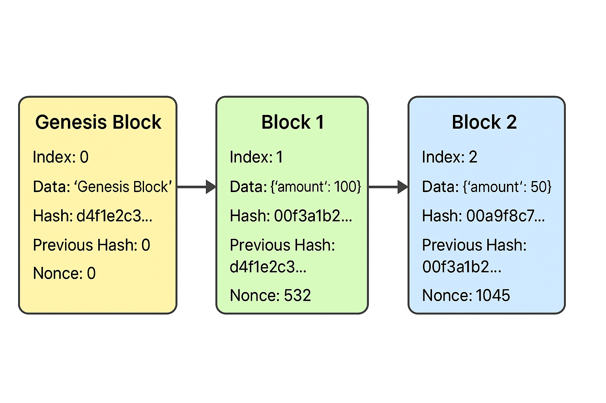

# Simple Blockchain Project

## Overview
This project implements a simple **Blockchain system** in Python. It demonstrates the fundamental concepts of blockchain, including blocks, hashing, proof-of-work mining, and validation.

## Features
- **Block creation**: Each block contains an index, timestamp, data, previous hash, nonce, and hash.
- **Proof-of-Work mining**: Blocks are mined by finding a hash starting with a number of leading zeros (difficulty).
- **Blockchain validation**: Ensures integrity of the chain by checking each block's hash and previous hash.

## Components
1. `blockchain.py`
    - `Block` class: Represents a single block.
    - `Blockchain` class: Manages the chain and mining difficulty.
2. `app.py`
    - Demonstrates creating and mining blocks.
3. `requirements.txt`
    - Lists dependencies (only Python standard library is used in this project).

## How It Works
1. **Genesis Block**: The first block of the blockchain is created manually.
2. **Adding Blocks**: When a new block is added, it references the previous block's hash and mines until the hash meets the difficulty.
3. **Mining (Proof-of-Work)**: Nonce is incremented until a hash with the required leading zeros is found.
4. **Validation**: Checks each block's hash and ensures the `previous_hash` matches the hash of the previous block.

## Example Output

When running `app.py` with `difficulty = 2`, the output could look like this:
Mining block 1...
Block mined: 00f3a1b2c4d5e6f7890a1b2c3d4e5f67890abcde1234567890abcdef12345678
Mining block 2...
Block mined: 00a9f8c7b6d5e4f3a2b1c0d9e8f7a6b5c4d3e2f1a0b9c8d7e6f5a4b3c2d1e0f9

Blockchain:
Index: 0, Hash: d4f1e2c3b4a5d6e7f8a9b0c1d2e3f4a5b6c7d8e9f0a1b2c3d4e5f6a7b8c9d0e1, Data: Genesis Block
Index: 1, Hash: 00f3a1b2c4d5e6f7890a1b2c3d4e5f67890abcde1234567890abcdef12345678, Data: {'amount': 100}
Index: 2, Hash: 00a9f8c7b6d5e4f3a2b1c0d9e8f7a6b5c4d3e2f1a0b9c8d7e6f5a4b3c2d1e0f9, Data: {'amount': 50}

Is blockchain valid? True


### Explanation of Output
1. **Mining block 1…**  
   - The system searches for a nonce such that the block’s hash starts with two zeros `00`.  
   - After finding the correct nonce, the block hash is displayed.

2. **Mining block 2…**  
   - The same mining process is repeated for the second block (`amount: 50`).

3. **Blockchain**  
   - Displays all blocks in the chain:
     - `Index 0` = Genesis Block  
     - `Index 1 & 2` = Newly added blocks, each with its own hash and data.

4. **Is blockchain valid? True**  
   - Validates the blockchain by checking each block’s hash and previous hash.  
   - Returns `True` because all blocks are correctly linked.

> ⚠️ Note: Hash values will be different on each run due to the timestamp in each block.

## How to Run
1. Clone this repository.
2. Install Python 3.x.
3. Run `app.py`:
    ```bash
    python app.py
    ```
4. Observe the mining process and blockchain validation output.

## Key Concepts
- **Hashing**: Ensures block integrity. If any data changes, the hash changes.
- **Proof-of-Work**: Secures blockchain by requiring computational work to add blocks.
- **Decentralization (conceptual)**: Each node could have its own copy of the blockchain.
- **Security**: Tampering with data invalidates the blockchain due to hash mismatch.

## Blockchain Diagram

Each block in the blockchain contains its index, timestamp, data, previous hash, nonce, and hash.  
Blocks are linked together via the `previous_hash` field, forming a chain.



### Explanation:

1. **Genesis Block**
   - The first block in the chain. Its `previous_hash` is set to `0`.

2. **Block 1**
   - References `Genesis Block` via `previous_hash`.
   - Mined using proof-of-work to find a hash starting with `00`.

3. **Block 2**
   - References `Block 1` via `previous_hash`.
   - Mined to satisfy the difficulty requirement.

**Flow of blockchain:**
- Each block is connected to the previous one.
- Any tampering with data changes the hash, invalidating the chain.
- Mining ensures each block's hash meets the difficulty, securing the chain.

---